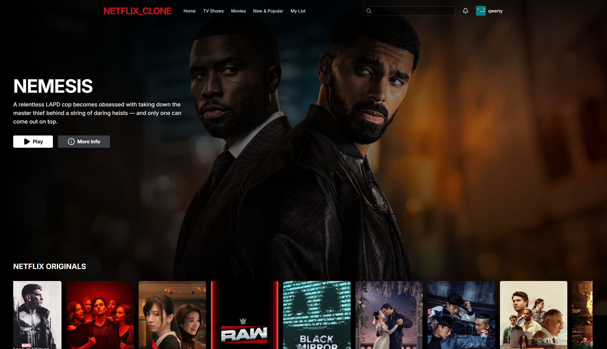

# 🎬 Realistic Netflix Clone (Frontend)

A high-fidelity, production-ready Netflix clone built with React 19, Tailwind CSS, and Framer Motion. This project features authentic Netflix aesthetics, smooth cinematic animations, and real-time data fetching from TMDB.



## ✨ Features

- **Realistic Netflix UI**: Deep black theme, red accents, and glassmorphism.
- **Cinematic Animations**: Smooth card scaling, fade-in transitions, and hover effects using Framer Motion.
- **Authentication**: Secure Login and Signup powered by Firebase.
- **Real-time Data**: Dynamic movie content fetched from TMDB API (Trending, Top Rated, Netflix Originals, etc.).
- **Hero Banner**: High-resolution backdrop with cinematic gradients and auto-play feel.
- **Responsive Design**: Mobile-first approach, fully optimized for all devices.
- **Search**: Dynamic movie search functionality.
- **Profile Management**: Custom profile section and persistent auth state.

## 🚀 Tech Stack

- **Frontend**: React 19, Vite
- **Styling**: Tailwind CSS
- **Animations**: Framer Motion
- **Icons**: Lucide React
- **API**: TMDB (The Movie Database)
- **Auth**: Firebase
- **Routing**: React Router DOM

## 🛠️ Setup Instructions

1. **Clone the repository**:
   ```bash
   git clone https://github.com/your-username/netflix-clone.git
   cd netflix-clone
   ```

2. **Install dependencies**:
   ```bash
   npm install
   ```

3. **Configure Environment Variables**:
   Create a `.env` file in the root directory and add your API keys:
   ```env
   VITE_TMDB_API_KEY=your_tmdb_api_key
   VITE_FIREBASE_API_KEY=your_firebase_api_key
   VITE_FIREBASE_AUTH_DOMAIN=your_project.firebaseapp.com
   VITE_FIREBASE_PROJECT_ID=your_project_id
   VITE_FIREBASE_STORAGE_BUCKET=your_project.appspot.com
   VITE_FIREBASE_MESSAGING_SENDER_ID=your_sender_id
   VITE_FIREBASE_APP_ID=your_app_id
   ```

4. **Run the development server**:
   ```bash
   npm run dev
   ```

5. **Build for production**:
   ```bash
   npm run build
   ```

## 📂 Project Structure

```text
src/
├── components/      # Modular UI components (Navbar, Banner, Row, etc.)
├── pages/           # Main application pages (Home, Login, Signup, etc.)
├── services/        # API and Firebase configurations
├── context/         # Authentication and state management
├── assets/          # Static assets and icons
└── index.css        # Global styles and Tailwind utilities
```

## 📄 License

This project is open-source and available under the [MIT License](LICENSE).

---
Developed by Priyanshu 
